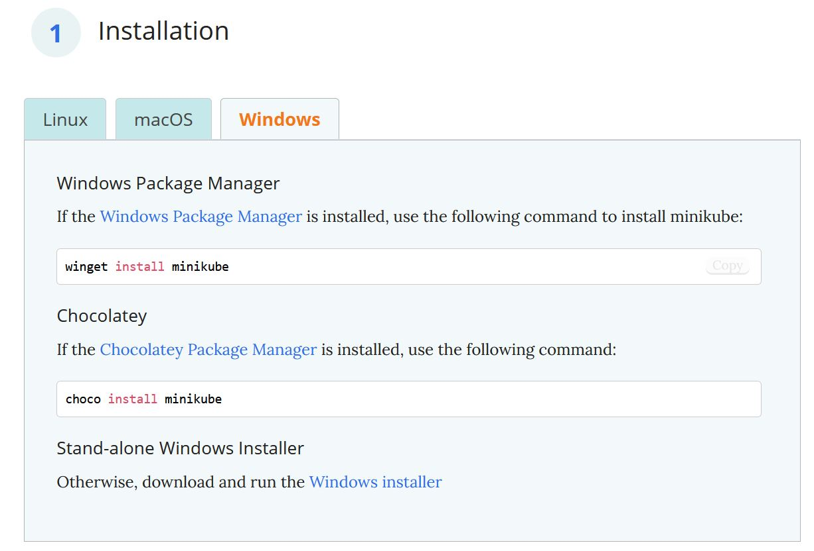
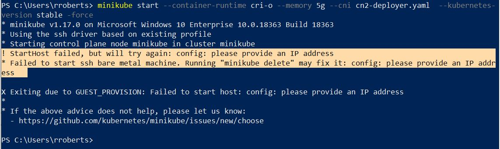

# Cloud Native Contrail Early Testings on my Windows Laptop

##  Contrail turns into a Kubernetees-native application !

These days, we're taking Contrail and making it truly kubernetees-native.
This is a major change in our configuration plane, as contrail logic is being migrated to the kube API thanks to custom ressources.
This will make Contrail being as easy to consume as any application. Install it, take your manifest to buid your networking logic and here you go: you get advanced container routing with advanced networking functionalities.

For example, check out below the definition of a BGP peering toward a physical router (MX). Networkers will notice the rich afi/safi support (address-family) and figure out how connectivity and integration becomes simple thanks to an advanced MP-BGP control plane.

```
cat mx.yaml
apiVersion: core.contrail.juniper.net/v1alpha1
kind: BGPRouter
metadata:
  name: mx
  namespace: default-project
spec:
  bgpRouterParameters:
    address: 192.168.39.254
    addressFamilies:
      family:
      - inet
      - inet-labeled
      - inet-vpn
      - e-vpn
      - erm-vpn
      - route-target
      - inet6
      - inet-mvpn
      - inet6-vpn
    autonomousSystem: 64512
    identifier: 192.168.39.254
    port: 179
    routerType: router
    vendor: Juniper
  bgpRouterReferences:
  - apiVersion: core.contrail.juniper.net/v1alpha1
    attributes: {}
    fqName:
    - default-domain
    - default-project
    - ip-fabric
    - default
    - minikube
    kind: BGPRouter
    name: minikube
    namespace: default-project
  parent:
    apiVersion: core.contrail.juniper.net/v1alpha1
    kind: RoutingInstance
    name: default
    namespace: default-project
```

Hence I am pretty exciting to test the kubernetees-native routing platform. Right now builds are Juniper-internal, but stay tuned -and there's much more to come-.
## Installation procedure

### Minikube install on windows

 First [install minikube](<https://minikube.sigs.k8s.io/docs/start/>). Here, I actually used the [windows installer](https://github.com/kubernetes/minikube/releases/download/v1.17.0/minikube-installer.exe)

That was rather straightforward (next, agree, etc.).

### Hyper-V installation

We will use windows Hyper-V.
You can check the status of Hyper-V install by entering the systeminfo command in a powershell window.

```
PS C:\Users\rroberts> systeminfo

Host Name:                 RROBERTS-P50
OS Name:                   Microsoft Windows 10 Enterprise
OS Version:                10.0.18363 N/A Build 18363
[...]
                                 [02]: fe80::15fd:982d:57ac:da9a
Hyper-V Requirements:      A hypervisor has been detected. Features required for Hyper-V will not be displayed.
PS C:\Users\rroberts>
```

The last line is what expect (here Hyper-V was previously installed). If Hyper-V is not installed, just follow the steps listed on the [Microsoft Website](https://docs.microsoft.com/en-us/virtualization/hyper-v-on-windows/quick-start/enable-hyper-v)

Then run the following commands via powershell **in administrator mode**: 

```
PS C:\WINDOWS\system32> Enable-WindowsOptionalFeature -Online -FeatureName Microsoft-Hyper-V -All


Path          :
Online        : True
RestartNeeded : False


PS C:\WINDOWS\system32> DISM /Online /Enable-Feature /All /FeatureName:Microsoft-Hyper-V

Deployment Image Servicing and Management tool
Version: 10.0.18362.1316

Image Version: 10.0.18363.1316

Enabling feature(s)
[==========================100.0%==========================]
The operation completed successfully.
PS C:\WINDOWS\system32> 

```

### Configure a VSWITCH

Minikube requires a virtual switch to run properly. If you did not configure any, you'll get an error message similar to the capture below.



So let's define a virtual switch called minikube.
Type the following command in a powershell window (**Administrator mode mandatory**).

```
New-VMSwitch -name minikube -NetAdapterName Ethernet -AllowManagementOS $true

PS C:\minikube> New-VMSwitch -name minikube -SwitchType internal

Name     SwitchType NetAdapterInterfaceDescription
----     ---------- ------------------------------
minikube Internal


PS C:\minikube>
```
Then get the CN2 deployment manifest (we use a specific directory called minikube as administrator default to the system32 folder).
```
PS C:\WINDOWS\system32> cd C:\
PS C:\> mkdir minikube


    Directory: C:\


Mode                LastWriteTime         Length Name
----                -------------         ------ ----
d-----        1/27/2021   2:40 PM                minikube


PS C:\> cd minikube
PS C:\minikube> curl -o cn2-deployer.yaml https://raw.githubusercontent.com/robric/CN2-testings/main/manifests/cn2-deployer.yaml
```

Then you 
```
minikube start --container-runtime cri-o --memory 5g --cni cn2-deployer.yaml  --vm-driver hyperv --hyperv-virtual-switch "minikube"
```

